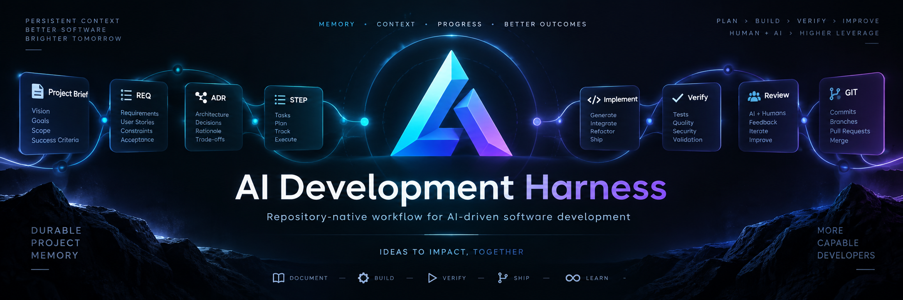
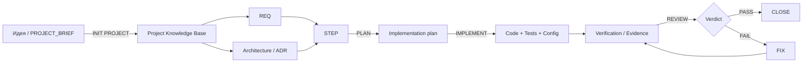
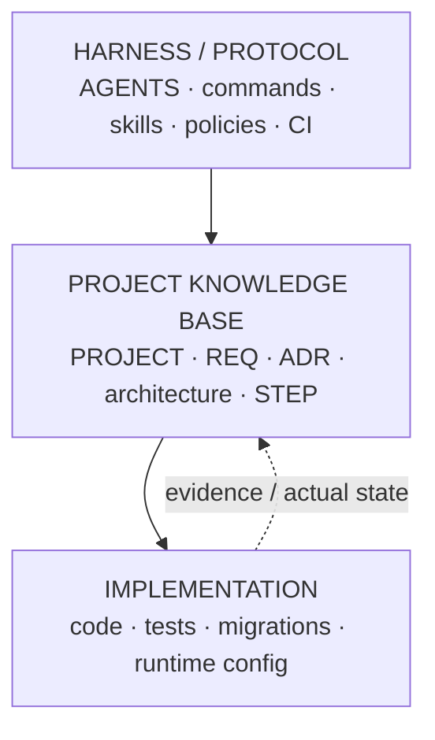
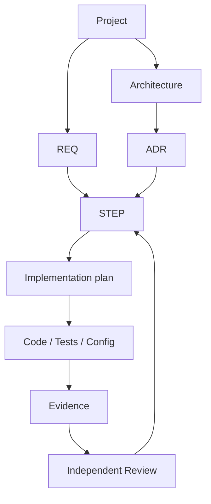

<div align="center">



# AI Development Harness

**Repository-native workflow для разработки ПО с AI-агентами без потери контекста между сессиями.**

Требования, архитектурные решения, задачи, планы реализации, проверки и результаты review живут рядом с кодом — в Git.

[](https://github.com/ai-development-harness/ai-development-harness-template)
[](https://github.com/ai-development-harness/ai-development-harness-template/blob/main/LICENSE)
[](https://ai-development-harness.ru)

[Начать с шаблона](https://github.com/ai-development-harness/ai-development-harness-template) ·
[Документация](https://github.com/ai-development-harness/ai-development-harness-template/tree/main/docs/harness)
</div>

---

## Зачем нужен AI Development Harness

AI-агент хорошо решает локальную задачу, пока видит достаточный контекст. Проблемы начинаются позже:

- новая сессия не знает, почему было принято архитектурное решение;
- требования остаются в чатах и постепенно расходятся с кодом;
- план реализации исчезает после завершения диалога;
- агент может начать работу не с той задачи или расширить scope;
- review смешивается с implementation и теряет независимость;
- небольшие изменения либо проходят бесконтрольно, либо обрастают лишней бюрократией;
- через несколько недель сложно понять, **что было задумано, что реально сделано и чем это доказано**.

**AI Development Harness переносит долговременный контекст из чата в репозиторий.**

Чат становится интерфейсом управления.  
Репозиторий становится памятью проекта и источником истины.

---

## Как это работает



Harness связывает продуктовые требования, архитектуру и фактическую реализацию:

```text
REQ  → что продукт обязан обеспечивать
ADR  → почему принято устойчивое архитектурное решение
STEP → конкретный контракт работы
PLAN → как STEP будет реализован
CODE → что реально изменилось
EVIDENCE → чем выполнение доказано
REVIEW → независимая проверка результата
```

В результате следующая сессия или другой агент может продолжить работу **из состояния репозитория**, без необходимости пересказывать историю предыдущего чата.

---

## Три слоя Harness



### 1. Harness / Protocol

Постоянные правила работы AI-агентов:

- repository-level инструкции;
- команды Harness;
- роли и конфигурация моделей;
- Git policy;
- execution protocol;
- CI / integrity checks;
- repository skills.

### 2. Project Knowledge Base

Долговременная память конкретного проекта:

- описание проекта;
- требования;
- архитектурный baseline;
- ADR;
- открытые вопросы;
- roadmap;
- STEP-файлы;
- результаты review, audit и release checks.

### 3. Implementation

Обычный production-код проекта:

- приложение;
- тесты;
- миграции;
- конфигурация;
- инфраструктура.

Harness не заменяет кодовую базу — он создаёт вокруг неё управляемый процесс работы AI-агентов.

---

## Быстрый старт

### 1. Создай проект из template

Открой:

**https://github.com/ai-development-harness/ai-development-harness-template**

и нажми **Use this template**.

### 2. Создай локальный brief

```bash
cp PROJECT_BRIEF.example.md PROJECT_BRIEF.local.md
```

Опиши проект обычным языком:

- что нужно создать;
- кто будет этим пользоваться;
- ключевые сценарии;
- ограничения;
- желательный стек;
- что не входит в scope;
- ссылки на документацию, API, дизайн и референсы.

Не нужно вручную писать REQ, ADR или STEP.

### 3. Запусти bootstrap

Открой проект в поддерживаемом AI coding agent и выполни:

```text
INIT PROJECT
```

Initializer создаст project knowledge base, требования, архитектурный baseline, roadmap и первые STEP, но **не начнёт писать production-код**.

### 4. Проверь состояние

```text
STATUS PROJECT
NEXT STEP
```

### 5. Запусти разработку

Полный автоматизированный flow:

```text
RUN STEP-001
```

Или вручную:

```text
PLAN STEP-001
IMPLEMENT STEP-001
REVIEW STEP-001
```

---

## Основные команды

| Команда | Назначение |
|---|---|
| `INIT PROJECT` | Инициализировать проект из локального brief |
| `ADD STEP: <описание>` | Превратить новую задачу в полноценный STEP |
| `PLAN STEP-NNN` | Сохранить технический план реализации |
| `IMPLEMENT STEP-NNN` | Реализовать STEP в рамках зафиксированного scope |
| `REVIEW STEP-NNN` | Провести независимый review |
| `FIX STEP-NNN` | Исправить подтверждённые findings |
| `RUN STEP-NNN` | Выполнить orchestrated PLAN → IMPLEMENT → REVIEW → FIX → CLOSE |
| `QUICK FIX: <описание>` | Сделать безопасную micro-change без лишнего STEP |
| `STATUS PROJECT` | Проверить состояние проекта и drift |
| `NEXT STEP` | Выбрать следующий unblocked STEP |
| `RECONCILE PROJECT` | Сверить документацию с фактическим состоянием кода |
| `RELEASE CHECK` | Выполнить финальные release-oriented проверки |
| `FIND SKILL: <описание>` | Найти подходящий Agent Skill |
| `INSTALL SKILL: <source \| #N>` | Безопасно установить выбранный skill |
| `CREATE SKILL: <описание>` | Создать project-native skill |
| `GENERATE GITHUB TEMPLATES` | Пересоздать Issue Forms и PR template под текущий проект |
| `GIT CHECK` | Выполнить безопасный Git preflight |
| `COMMIT` | Создать проверенный локальный commit |
| `PUSH` | Без force опубликовать текущую ветку |
| `PR` | Создать или вернуть существующий Pull Request |
| `SYNC` | Проверить divergence и безопасно синхронизироваться |

Полное описание команд:  
[`docs/harness/COMMANDS.md`](https://github.com/ai-development-harness/ai-development-harness-template/blob/main/docs/harness/COMMANDS.md)

---

## Почему не просто `AGENTS.md` и хороший prompt

Harness решает более широкую задачу.

Хорошие инструкции помогают агенту работать **сейчас**.  
Harness помогает проекту сохранять инженерную целостность **между сессиями, агентами и этапами разработки**.

| Только prompt / инструкции | AI Development Harness |
|---|---|
| Контекст часто живёт в чате | Контекст сохраняется в Git |
| План может исчезнуть после сессии | План хранится внутри STEP |
| Требования легко потерять | REQ являются отдельными контрактами |
| Architecture decisions остаются неформальными | Устойчивые решения фиксируются ADR |
| Reviewer может повторять логику implementer | Review выделен в независимый этап |
| Статус проекта приходится восстанавливать | PLAN / STATUS строятся из канонических данных |
| Новая сессия требует пересказа | Durable handoff хранится в репозитории |

---

## Traceability вместо «поверь, что готово»

Harness разделяет разные типы знания и связывает их между собой:



STEP не считается завершённым только потому, что агент написал «готово».

Acceptance criteria должны подтверждаться проверками, артефактами и review evidence.

---

## Маленькие изменения без бюрократии

Не каждая опечатка заслуживает отдельного процесса.

Для безопасных micro-changes существует:

```text
QUICK FIX: исправить опечатку в тексте ошибки
```

`QUICK FIX` разрешён только когда изменение не затрагивает:

- product contract;
- API;
- data model;
- security;
- архитектуру;
- зависимости.

Если изменение оказывается больше ожидаемого, Harness должен остановить quick-flow и предложить полноценный `ADD STEP`.

---

## Независимый review

Одна из ключевых идей Harness — **implementer не должен сам подтверждать корректность собственной реализации**.

Типичный `RUN STEP-NNN`:

```text
PLAN
  ↓
IMPLEMENT
  ↓
deterministic verification
  ↓
REVIEW
  ↓
PASS ───────────────→ CLOSE
  │
 FAIL
  ↓
FIX
  ↓
REVIEW
```

Review создаёт отдельный immutable report и возвращает один из verdict:

- `PASS`
- `FAIL`
- `BLOCKED`

Это делает состояние проекта проверяемым и пригодным для handoff между агентами.

---

## Git тоже часть protocol

Harness управляет не только кодированием, но и безопасным переходом изменений в Git:

```text
GIT CHECK
   ↓
COMMIT
   ↓
PUSH
   ↓
PR
```

Политика хранится в проекте, а не в памяти текущего диалога.

Harness проверяет рабочую копию, branch policy, divergence, suspicious files и integrity перед потенциально изменяющими Git-операциями.

---

## Skills без слепой установки

Проект может расширять возможности агентов через repository skills.

```text
FIND SKILL: <что требуется>
        ↓
inspect / compare / provenance / safety
        ↓
INSTALL SKILL: #N
```

Если подходящего готового skill нет:

```text
CREATE SKILL: <описание>
```

Сторонний skill рассматривается как **недоверенный внешний контент**: Harness сначала инспектирует его происхождение и содержимое и только затем допускает установку.

---

## Репозитории организации

| Репозиторий | Назначение |
|---|---|
| [`ai-development-harness-template`](https://github.com/ai-development-harness/ai-development-harness-template) | Основной template и источник истины для Harness |

### Основной template

[`ai-development-harness-template`](https://github.com/ai-development-harness/ai-development-harness-template) содержит:

```text
.
├── AGENTS.md
├── PROJECT_BRIEF.example.md
├── .project/
├── .codex/
├── .agents/skills/
├── docs/
│   ├── requirements/
│   ├── adr/
│   └── harness/
├── planning/
│   ├── tasks/
│   ├── reviews/
│   ├── audits/
│   └── releases/
├── tools/harness/
└── .github/
```

Product implementation намеренно отсутствует в template и появляется уже в конкретном проекте.

---

## Ключевые принципы

**Repository over chat**  
Важный контекст должен переживать текущую сессию.

**Explicit contracts**  
Требования и задачи должны быть проверяемыми, а не подразумеваемыми.

**Traceability**  
REQ, ADR, STEP, implementation и evidence должны быть связаны.

**No invented decisions**  
Неизвестность фиксируется как вопрос или research task, а не маскируется выдуманным ADR.

**Independent review**  
Реализация и проверка разделены.

**Actual state matters**  
Код, тесты, migrations и config учитываются как фактическое состояние системы.

**Small changes stay small**  
Micro-change не должна превращаться в бюрократический ритуал.

**Safe automation**  
Автоматизация должна останавливаться на blocker, а не скрывать failure.

---

## Документация

Начать лучше отсюда:

- [Начало работы](https://github.com/ai-development-harness/ai-development-harness-template/blob/main/docs/harness/GETTING_STARTED.md)
- [Модель документации и traceability](https://github.com/ai-development-harness/ai-development-harness-template/blob/main/docs/harness/DOCUMENT_MODEL.md)
- [Команды Harness](https://github.com/ai-development-harness/ai-development-harness-template/blob/main/docs/harness/COMMANDS.md)
- [Структура репозитория](https://github.com/ai-development-harness/ai-development-harness-template/blob/main/docs/harness/REPOSITORY_LAYOUT.md)
- [Настройка агентов и моделей](https://github.com/ai-development-harness/ai-development-harness-template/blob/main/docs/harness/AGENT_CONFIGURATION.md)
- [Git workflow](https://github.com/ai-development-harness/ai-development-harness-template/blob/main/docs/harness/GIT_WORKFLOW.md)
- [CI и Harness Integrity](https://github.com/ai-development-harness/ai-development-harness-template/blob/main/docs/harness/CI.md)
- [Управление Skills](https://github.com/ai-development-harness/ai-development-harness-template/blob/main/docs/harness/SKILL_MANAGEMENT.md)

---

## Статус проекта

AI Development Harness активно развивается.

Текущая цель — сформировать воспроизводимый repository-native protocol, который помогает AI coding agents работать над реальными проектами на длинной дистанции: от первичного brief до implementation, review, reconciliation и release checks.

Обратная связь, реальные сценарии использования и предложения по улучшению приветствуются через Issues основного репозитория.

---

## Лицензия

Основной template распространяется по лицензии **MIT**.

См. [`LICENSE`](https://github.com/ai-development-harness/ai-development-harness-template/blob/main/LICENSE).

---

<div align="center">

### AI Development Harness

**Чат управляет работой. Репозиторий хранит память. Git фиксирует историю.**

[Use this template](https://github.com/ai-development-harness/ai-development-harness-template) ·
[Documentation](https://github.com/ai-development-harness/ai-development-harness-template/tree/main/docs/harness) ·
[Website](https://ai-development-harness.ru)

</div>