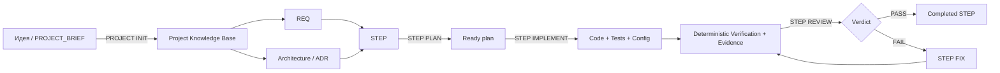
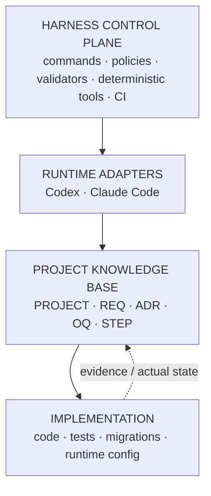

<div align="center">


# AI Development Harness

**Repository-native protocol для разработки ПО с AI-агентами без потери контекста между сессиями.**

Требования, архитектурные решения, задачи, планы, evidence, review и состояние выполнения живут рядом с кодом — в Git.

[](https://github.com/ai-development-harness/ai-development-harness-template/releases/latest)
[](https://github.com/ai-development-harness/ai-development-harness-template)
[](https://github.com/ai-development-harness/ai-development-harness-template/blob/main/LICENSE)
[](https://ai-development-harness.ru)

[Начать с шаблона](https://github.com/ai-development-harness/ai-development-harness-template) ·
[Документация](https://github.com/ai-development-harness/ai-development-harness-template/tree/main/.harness/docs) ·
[Последний релиз](https://github.com/ai-development-harness/ai-development-harness-template/releases/latest)

</div>

---

## Что решает Harness

AI-агент хорошо работает, пока видит достаточный контекст. На длинной дистанции возникают другие проблемы:

- новая сессия не знает, почему было принято архитектурное решение;
- требования остаются в чатах и расходятся с кодом;
- план реализации теряется после завершения диалога;
- агент может выйти за scope или начать не ту задачу;
- implementation и review смешиваются;
- после interruption трудно понять, что уже выполнено и откуда продолжать;
- Git-операции и публикация изменений легко превращаются в отдельный неформальный процесс;
- через несколько недель сложно доказать, **что было задумано, что сделано и чем это подтверждено**.

**AI Development Harness переносит долговременный инженерный контекст из чата в репозиторий.**

Чат или UI остаются интерфейсом управления.  
Git-репозиторий становится долговременной памятью проекта и источником истины.

---

## Как это работает



Связь артефактов:

```text
REQ      → что продукт обязан обеспечивать
ADR      → почему принято устойчивое архитектурное решение
STEP     → конкретный контракт работы
PLAN     → как STEP будет реализован
CODE     → что фактически изменилось
EVIDENCE → чем выполнение доказано
REVIEW   → независимая проверка результата
```

Следующая сессия или другой агент продолжает работу из состояния репозитория, а не из пересказа предыдущего чата.

---

## Что изменилось в актуальном Harness

Современный Harness отделяет **semantic reasoning** от механических и safety-critical операций.

Канонические команды имеют явный namespace:

```text
PROJECT INIT
STEP RUN STEP-001
HARNESS STATUS
GIT CHECK > COMMIT > PUSH > PR
```

Допустимые команды и переходы хранятся в machine-readable registry:

```text
.harness/command-transitions.json
```

Raw command проходит нормализацию, structural validation и dispatch. Там, где решение можно получить детерминированно, отдельный model turn не используется. Semantic reasoning остаётся там, где действительно нужно понимать intent, код, архитектуру или качество реализации.

В актуальном релизе deterministic tooling отвечает, в частности, за:

- command routing и допустимость chain;
- состояние и resume незавершённых executions;
- project status и выбор следующей работы;
- Verification и фиксацию evidence;
- safety gates Git-операций;
- self-update Harness;
- projections и integrity checks.

---

## Четыре слоя Harness



### 1. Harness control plane

Основные protocol-файлы живут в `.harness/**`:

- manifest и policy;
- command transition graph;
- execution protocol;
- validators;
- deterministic command/Git/update tooling;
- локальное operational state;
- документация Harness.

### 2. Runtime adapters

Harness protocol не привязан к одному coding agent или одной модели.

Поддерживаемые adapter surfaces:

- **Codex** — `.codex/config.toml` + `.codex/agents/*.toml`;
- **Claude Code** — `CLAUDE.md` + `.claude/settings.json` + `.claude/agents/*.md`.

`AGENTS.md`, REQ/ADR/STEP, execution protocol и `.agents/skills/` остаются общими источниками истины.

### 3. Project Knowledge Base

Долговременная память проекта:

- описание проекта;
- REQ;
- architecture baseline;
- ADR;
- OQ;
- roadmap;
- STEP;
- review/audit/release reports;
- deterministic PLAN/STATUS projections.

### 4. Implementation

Обычная production-кодовая база:

- приложение;
- тесты;
- миграции;
- конфигурация;
- инфраструктура.

Harness не заменяет кодовую базу — он задаёт воспроизводимый процесс работы вокруг неё.

---

## Требования

Для актуального Harness нужны:

- **Git**;
- **Python 3.11+** для deterministic tools и validators;
- **Codex или Claude Code** как runtime agent-session;
- **GitHub CLI `gh`** — только для текущей GitHub Pull Request capability: `GIT PR` и `GIT PR FINISH`.

Отсутствие `gh` не блокирует Harness целиком: Git workflow без PR остаётся доступен.

---

## Быстрый старт

### 1. Создай проект из template

Открой:

**https://github.com/ai-development-harness/ai-development-harness-template**

и нажми **Use this template**.

### 2. Создай local brief

```bash
cp PROJECT_BRIEF.example.md PROJECT_BRIEF.local.md
```

Опиши проект обычным языком: цель, пользователей, сценарии, ограничения, предпочтительный стек, референсы и важные заметки.

`PROJECT_BRIEF.local.md` — local-only файл и не должен попадать в Git.

### 3. При необходимости настрой Harness

До инициализации можно изменить project-configurable параметры в:

```text
.harness/manifest.yaml
```

В том числе язык, пути project knowledge, лимит FIX ↔ REVIEW, policy specialized reviewers и другие настройки.

### 4. Инициализируй проект

Открой repository в Codex или Claude Code и выполни:

```text
PROJECT INIT
```

Initializer создаёт project knowledge base, REQ, architecture baseline, ADR/OQ при необходимости, roadmap и STEP, выполняет semantic checks и deterministic validation, но **не пишет production-код**.

### 5. Проверь состояние

```text
PROJECT STATUS
STEP NEXT
```

### 6. Запусти разработку

Полный orchestrated flow:

```text
STEP RUN STEP-001
```

Или вручную:

```text
STEP PLAN STEP-001
STEP IMPLEMENT STEP-001
STEP REVIEW STEP-001
```

---

## Канонические команды

Команды сгруппированы по областям. Полным source of truth является `.harness/command-transitions.json`.

| Область | Команда | Назначение |
|---|---|---|
| HARNESS | `HARNESS HELP` | Показать актуальную справку по command surface |
| HARNESS | `HARNESS STATUS` | Показать состояние Harness, Git и незавершённых executions |
| HARNESS | `HARNESS RESUME` | Продолжить единственное безопасно возобновляемое выполнение |
| HARNESS | `HARNESS DOCTOR` | Проверить required dependencies и health Harness |
| HARNESS | `HARNESS CONFIG` | Показать effective configuration и её источники |
| HARNESS | `HARNESS UPDATE CHECK [TO <tag>]` | Read-only проверить допустимый маршрут обновления |
| HARNESS | `HARNESS UPDATE APPLY [TO <tag>]` | Применить проверенное обновление Harness |
| PROJECT | `PROJECT INIT` | Инициализировать проект из local brief |
| PROJECT | `PROJECT STATUS` | Пересобрать projections и показать состояние проекта |
| PROJECT | `PROJECT RECONCILE` | Сверить project knowledge с фактическим состоянием repository |
| PROJECT | `PROJECT QUICK FIX: <описание>` | Выполнить маленькую low-risk правку без STEP |
| STEP | `STEP ADD: <описание>` | Создать новый STEP из краткого описания |
| STEP | `STEP LIST` | Показать компактный список STEP |
| STEP | `STEP SHOW STEP-NNN` | Показать состояние и контекст одного STEP |
| STEP | `STEP NEXT` | Детерминированно рекомендовать следующую доступную работу |
| STEP | `STEP PLAN STEP-NNN` | Подготовить и независимо проверить план |
| STEP | `STEP IMPLEMENT STEP-NNN` | Реализовать Ready plan |
| STEP | `STEP REVIEW STEP-NNN` | Провести независимый review exact revision |
| STEP | `STEP FIX STEP-NNN` | Исправить подтверждённые findings |
| STEP | `STEP RUN STEP-NNN` | Оркестрировать PLAN → IMPLEMENT → REVIEW → FIX |
| STEP | `STEP AUDIT STEP-NNN` | Провести formal audit без production mutation |
| SKILL | `SKILL FIND: <описание>` | Найти подходящие Agent Skills |
| SKILL | `SKILL INSTALL: <source \| #N>` | Проверить и установить выбранный skill |
| SKILL | `SKILL CREATE: <описание>` | Создать project-native skill |
| GITHUB | `GITHUB GENERATE TEMPLATES` | Пересоздать Issue Forms и PR template под проект |
| RELEASE | `RELEASE CHECK` | Провести release-oriented проверку |
| GIT | `GIT CHECK` | Выполнить deterministic Git preflight |
| GIT | `GIT COMMIT[: <подсказка>]` | Создать проверенный локальный commit |
| GIT | `GIT PUSH` | Без force опубликовать текущую ветку |
| GIT | `GIT PR` | Создать или переиспользовать Pull Request |
| GIT | `GIT PR FINISH` | Безопасно завершить local branch lifecycle после merge |
| GIT | `GIT SYNC` | Проверить divergence или выполнить разрешённый ff-only sync |

Полное описание:  
[COMMANDS.md](https://github.com/ai-development-harness/ai-development-harness-template/blob/main/.harness/docs/COMMANDS.md)

---

## Цепочки команд

Для разрешённых команд одной области namespace можно не повторять:

```text
GIT CHECK > COMMIT > PUSH > PR
STEP PLAN STEP-024 > IMPLEMENT > REVIEW
HARNESS UPDATE CHECK TO vX.X.X > APPLY
```

Вся цепочка сначала проверяется по `.harness/command-transitions.json`. Недопустимый порядок отклоняется **до выполнения первого сегмента**.

Cross-domain chain не является допустимой командой:

```text
STEP RUN STEP-024 > GIT COMMIT
```

Git-публикацию после STEP нужно запускать отдельной командой/цепочкой.

---

## Независимый review и deterministic Verification

Одна из базовых идей Harness — implementer не должен сам подтверждать корректность собственной реализации.

Типичный coding flow:

```text
STEP PLAN
    ↓
STEP IMPLEMENT
    ↓
deterministic Verification
    ↓
generated Evidence
    ↓
STEP REVIEW
    ↓
PASS ──────────────→ completed
 │
 FAIL
 ↓
STEP FIX
 ↓
Verification
 ↓
STEP REVIEW
```

Review создаёт immutable report и относится к exact repository revision.

Лимит FIX → REVIEW настраивается в `.harness/manifest.yaml`:

```yaml
execution:
  maxFixReviewCycles: 3
```

Допустимый диапазон — 1..5.

---

## Resume после interruption

Operational state хранится локально:

```text
.harness/local/execution/execution-status.json
```

Он не является project evidence и не коммитится.

Если session/process оборвался, Harness умеет продолжить незавершённое выполнение:

```text
HARNESS STATUS
HARNESS RESUME
```

`STEP RUN STEP-NNN` также использует crash-safe execution state и не должен создавать второй параллельный root execution для уже выполняющегося STEP.

---

## Маленькие изменения без бюрократии

Не каждая опечатка требует отдельного STEP.

Для безопасной micro-change:

```text
PROJECT QUICK FIX: исправить опечатку в тексте ошибки
```

Quick Fix допустим только если изменение не меняет product/API/data/security/architecture/dependencies. Если scope оказывается больше, flow должен остановиться и перейти к полноценному `STEP ADD:`.

Если мелкая правка уже внесена вручную, можно перейти сразу к Git workflow:

```text
GIT CHECK > COMMIT
```

---

## Git — часть protocol

Harness отделяет разработку от публикации. `STEP IMPLEMENT` и `STEP REVIEW` не создают commits автоматически.

Обычная публикация:

```text
GIT CHECK
   ↓
GIT COMMIT
   ↓
GIT PUSH
   ↓
GIT PR
```

Короткая форма:

```text
GIT CHECK > COMMIT > PUSH > PR
```

После merge:

```text
GIT PR FINISH
```

Safety-critical решения — protected branch, divergence, force prohibition, ff-only sync, PR state и другие gates — проверяются deterministic tooling.

По умолчанию Harness не делает автоматически:

- force push;
- hard reset;
- destructive clean;
- merge/rebase конфликтующей истории;
- commit amend;
- staging подозрительных или несвязанных файлов.

---

## Обновление Harness в существующем проекте

Проект можно обновлять без повторного `PROJECT INIT`.

```text
HARNESS UPDATE CHECK
        ↓
inspect route / conflicts
        ↓
HARNESS UPDATE APPLY
        ↓
inspect diff
        ↓
GIT CHECK > COMMIT
```

Или одной разрешённой chain:

```text
HARNESS UPDATE CHECK > APPLY
```

Self-update использует immutable release tags, ownership policy и 3-way merge для shared-файлов.

Основные paths по умолчанию:

```text
.harness/harness.lock.json
.harness/harness-update-graph.json
.harness/harness-update.toml
planning/harness-updates/
```

Update меняет protocol layer, но не переписывает project-owned REQ/ADR/STEP/OQ и production code. Если новый release требует migration активных project artifacts, после update используется:

```text
PROJECT RECONCILE
```

---

## Skills без слепой установки

```text
SKILL FIND: <что требуется>
        ↓
inspect / compare / provenance / safety
        ↓
SKILL INSTALL: #N
```

Если подходящего готового skill нет:

```text
SKILL CREATE: <описание>
```

Сторонний skill рассматривается как недоверенный внешний контент: Harness сначала проверяет источник, содержимое и риски, а затем допускает установку.

---

## Структура template

Упрощённо актуальная структура выглядит так:

```text
.
├── README.md
├── AGENTS.md
├── CLAUDE.md
├── PROJECT_BRIEF.example.md
├── .harness/
│   ├── manifest.yaml
│   ├── command-transitions.json
│   ├── harness.lock.json
│   ├── harness-update-graph.json
│   ├── harness-update.toml
│   ├── harness-policy.toml
│   ├── git-policy.toml
│   ├── docs/
│   ├── tools/
│   └── local/
├── .agents/skills/
├── .codex/
├── .claude/
├── docs/
│   ├── PROJECT.md
│   ├── architecture.md
│   ├── requirements/
│   ├── adr/
│   ├── open-questions/
│   └── skills/
├── planning/
│   ├── PLAN.md
│   ├── STATUS.md
│   ├── tasks/
│   ├── reviews/
│   ├── plan-reviews/
│   ├── init-reviews/
│   ├── audits/
│   ├── releases/
│   ├── harness-updates/
│   └── skill-searches/
└── .github/
```

Физические `docs/**` и `planning/**` — default layout. Project topology настраивается через `.harness/manifest.yaml`; core tooling не должен считать default paths скрытым вторым source of truth.

Product implementation намеренно отсутствует в template и появляется уже в конкретном проекте.

---

## Репозитории организации

| Репозиторий | Назначение |
|---|---|
| [`ai-development-harness-template`](https://github.com/ai-development-harness/ai-development-harness-template) | Основной template и источник истины Harness protocol |
| [`website`](https://github.com/ai-development-harness/website) | Публичный сайт проекта |
| [`ai-development-harness-client`](https://github.com/ai-development-harness/ai-development-harness-client) | Локальный browser-first UI для работы с Harness |
| [`ai-development-harness-vscode-extension`](https://github.com/ai-development-harness/ai-development-harness-vscode-extension) | Развиваемый IDE-слой/расширение VS Code над Harness |
| [`vscode-harness-navigator`](https://github.com/ai-development-harness/vscode-harness-navigator) | Read-only VS Code Navigator для артефактов и справки Harness |
| [`maintainer-tools`](https://github.com/ai-development-harness/maintainer-tools) | Maintainer control plane и release tooling |
| [`.github`](https://github.com/ai-development-harness/.github) | Публичный профиль GitHub-организации |

---

## Документация

Начать лучше отсюда:

- [Начало работы](https://github.com/ai-development-harness/ai-development-harness-template/blob/main/.harness/docs/GETTING_STARTED.md)
- [Команды Harness](https://github.com/ai-development-harness/ai-development-harness-template/blob/main/.harness/docs/COMMANDS.md)
- [Синтаксис команд и chains](https://github.com/ai-development-harness/ai-development-harness-template/blob/main/.harness/docs/COMMAND_SYNTAX.md)
- [Таблица допустимых переходов](https://github.com/ai-development-harness/ai-development-harness-template/blob/main/.harness/docs/COMMAND_TRANSITIONS.md)
- [Execution Protocol](https://github.com/ai-development-harness/ai-development-harness-template/blob/main/.harness/docs/EXECUTION_PROTOCOL.md)
- [Модель документации и traceability](https://github.com/ai-development-harness/ai-development-harness-template/blob/main/.harness/docs/DOCUMENT_MODEL.md)
- [Структура репозитория](https://github.com/ai-development-harness/ai-development-harness-template/blob/main/.harness/docs/REPOSITORY_LAYOUT.md)
- [Зависимости](https://github.com/ai-development-harness/ai-development-harness-template/blob/main/.harness/docs/DEPENDENCIES.md)
- [Настройка агентов и моделей](https://github.com/ai-development-harness/ai-development-harness-template/blob/main/.harness/docs/AGENT_CONFIGURATION.md)
- [Claude Code adapter](https://github.com/ai-development-harness/ai-development-harness-template/blob/main/.harness/docs/CLAUDE_CODE.md)
- [Обновление Harness](https://github.com/ai-development-harness/ai-development-harness-template/blob/main/.harness/docs/UPDATES.md)
- [Git workflow](https://github.com/ai-development-harness/ai-development-harness-template/blob/main/.harness/docs/GIT_WORKFLOW.md)
- [CI и Harness Integrity](https://github.com/ai-development-harness/ai-development-harness-template/blob/main/.harness/docs/CI.md)
- [Управление Skills](https://github.com/ai-development-harness/ai-development-harness-template/blob/main/.harness/docs/SKILL_MANAGEMENT.md)
- [Полное оглавление](https://github.com/ai-development-harness/ai-development-harness-template/blob/main/.harness/docs/README.md)

---

## Ключевые принципы

**Repository over chat**  
Важный контекст должен переживать текущую сессию.

**Explicit contracts**  
REQ и STEP должны быть проверяемыми, а не подразумеваемыми.

**Traceability**  
REQ, ADR, STEP, implementation, evidence и review связаны между собой.

**Deterministic where possible**  
Механические, routing- и safety-critical решения не должны зависеть от свободной интерпретации модели.

**No invented decisions**  
Неизвестность фиксируется как OQ, research или prerequisite work, а не маскируется выдуманным ADR.

**Independent review**  
Реализация и подтверждение корректности разделены.

**Crash-safe execution**  
Незавершённое выполнение можно продолжить из durable operational state.

**Small changes stay small**  
Micro-change не должна превращаться в лишний процесс.

**Safe automation**  
Automation должна останавливаться на blocker, а не скрывать failure.
